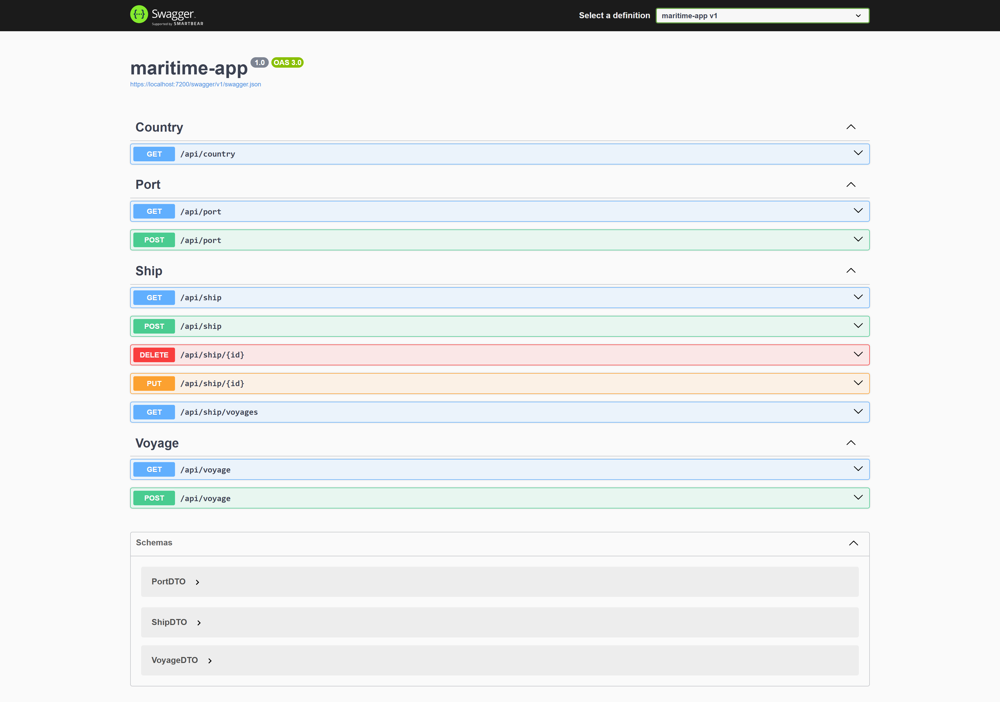

# Maritime App Backend

This is the **ASP.NET Core Web API backend** for the Maritime App.  
It provides RESTful endpoints to manage ships, voyages, ports, and countries, and connects to a PostgreSQL database.

---

## Features

✅ REST API with CRUD operations for:

- Ships
- Voyages
- Ports
- Countries

✅ Entity Framework Core with PostgreSQL
✅ DTO mappings for clean API responses  
✅ Swagger for interactive API testing

---

## Setup Instructions

### Clone the repository

```bash
git clone https://github.com/yourusername/maritime-app.git
cd backend
```

### Install dependencies

```
dotnet restore
```

### Apply database migrations

Ensure PostgreSQL is running and the database (e.g., maritime_db) exists.

```
dotnet ef database update
```

### Run the API

```
dotnet run
```

The API will run at:

```
https://localhost:5001/api
```

## Database Setup

In appsettings.json, update your PostgreSQL connection string:

```
"ConnectionStrings": {
  "DefaultConnection": "Host=localhost;Database=maritime_db;Username=youruser;Password=yourpassword"
}
```

Replace with your local or production DB credentials.

## Swagger Screenshots with Endpoints:


