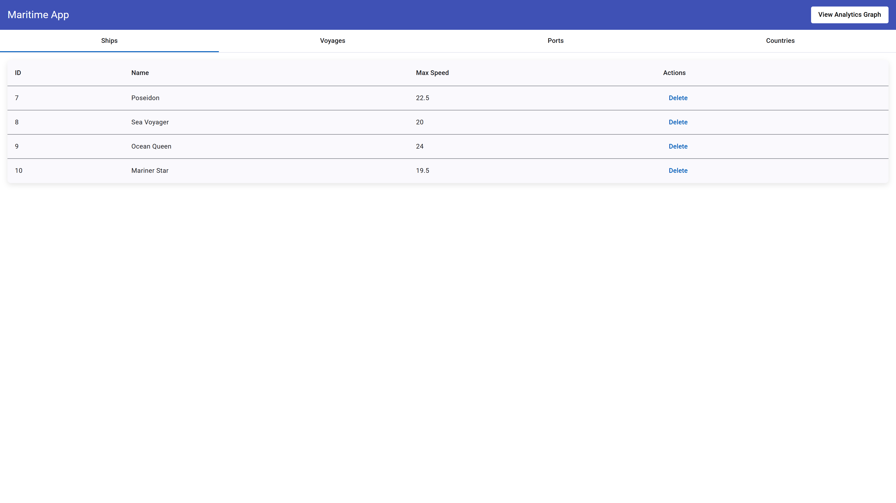
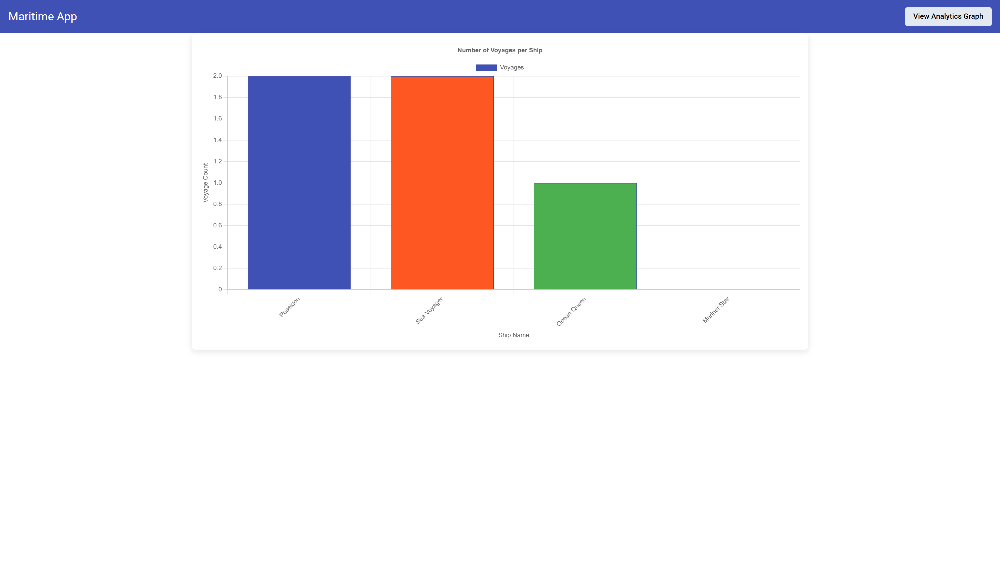
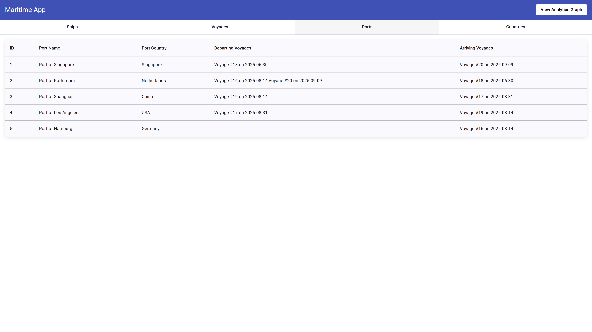
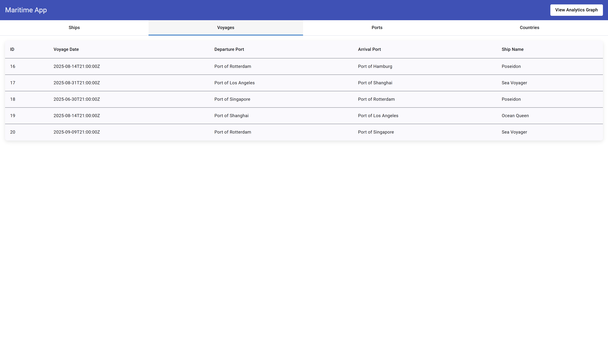
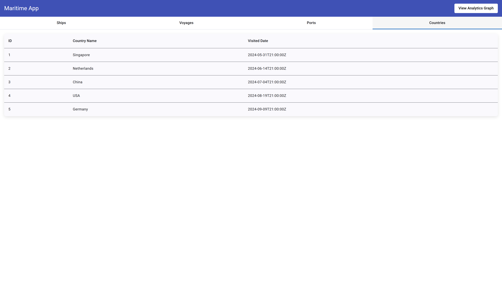

# Maritime App Frontend

This is the **Angular frontend** for a Maritime App project.  
It provides a web interface to manage ships, voyages, ports, countries, and visualize data graphs.

---

## Features

✅ View ships, voyages, and ports in interactive tables  
✅ Delete ships  
✅ Navigate between pages using Angular Router  
✅ Display analytics graphs using ng2-charts  
✅ Responsive design with Angular Material

---

## Screenshots

  


---

## Technologies Used

- Angular 19+
- Angular Material
- ng2-charts + Chart.js
- TypeScript
- RxJS

---

## How to Run Locally

This project was generated using [Angular CLI](https://github.com/angular/angular-cli) version 19.2.10.

## Development server

To start a local development server, run:

```bash
ng serve
```

Once the server is running, open your browser and navigate to `http://localhost:4200/`. The application will automatically reload whenever you modify any of the source files.

## Code scaffolding

Angular CLI includes powerful code scaffolding tools. To generate a new component, run:

```bash
ng generate component component-name
```

For a complete list of available schematics (such as `components`, `directives`, or `pipes`), run:

```bash
ng generate --help
```

## Building

To build the project run:

```bash
ng build
```

This will compile your project and store the build artifacts in the `dist/` directory. By default, the production build optimizes your application for performance and speed.

## API Connection

Make sure the backend API is running (see the backend README)
The frontend expects the API at:

```
http://localhost:5001/api
```

Update the API URL in environment.ts if needed.

## Additional Resources

For more information on using the Angular CLI, including detailed command references, visit the [Angular CLI Overview and Command Reference](https://angular.dev/tools/cli) page.

## More Screenshots

All the tables in the app.

  



---
